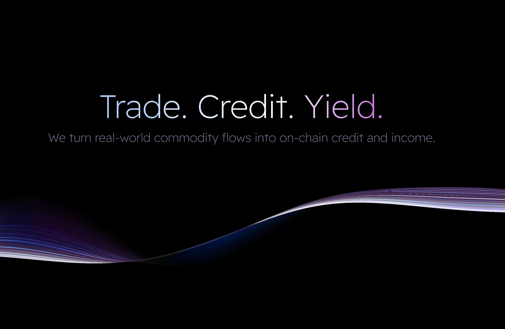

# PicWe Commodity Credit Network (BSC Testnet)

End-to-end commodity financing demo with registry, receivable pool, and mock stablecoin. Frontend + three smart contracts illustrating warehouse financing lifecycle: asset registration, LP deposits, borrower drawdown, payer repayment, asset clearing, and LP withdrawal.

## Repos

- Frontend: https://github.com/leafjava/picwe  
- Contracts: https://github.com/wblu214/cargox_contract

## Addresses (BSC Testnet, chainId 97)

- MockUSDT: `0xE707FEE53BfDd6C69Fc8D05caF148a6C28Edf49b`
- CommodityAssetRegistry: `0x8dB7E0ed381a43de2b7c46585529e9bA0063eAA1`
- ReceivablePool: `0x9F213109d2E9ADEA09e247AFC56bB2A03214C4E7`
  - BscScan: [MockUSDT](https://testnet.bscscan.com/address/0xE707FEE53BfDd6C69Fc8D05caF148a6C28Edf49b) · [Registry](https://testnet.bscscan.com/address/0x8dB7E0ed381a43de2b7c46585529e9bA0063eAA1) · [ReceivablePool](https://testnet.bscscan.com/address/0x9F213109d2E9ADEA09e247AFC56bB2A03214C4E7)

## Core Flow (matches contract enums)

1) **Register Asset**  
   `Pool.registerAsset(issuer, name, metadataURI, quantity, unit, referenceValue, status=Registered/0)` → `assetId`.
2) **Set InTransit**  
   `Pool.updateAssetStatus(assetId, InTransit=1)`.
3) **Create Financing Deal**  
   `Pool.createFinancingDeal(assetId, borrower, payer, interestRateBps, tenorDays)` → `dealId` (asset must be InTransit; borrower/payer ≠ 0).
4) **LP Deposit**  
   MockUSDT `approve(Pool, amount)` → `Pool.deposit(assetId, amount)`.
5) **Borrower Drawdown**  
   `Pool.drawdown(dealId, amount)` (caller = borrower) when liquidity is sufficient.
6) **Payer Repay**  
   MockUSDT `approve(Pool, payoffAmount(dealId))` → `Pool.repay(dealId)` (caller = payer).
7) **Clear Asset**  
   `Pool.updateAssetStatus(assetId, Cleared/3)`.
8) **LP Withdraw**  
   `Pool.withdraw(assetId)`.

AssetStatus enum: `0 Registered`, `1 InTransit`, `2 Collateralized`, `3 Cleared`.

## Frontend Pages (./app/(with-nav))

- **Products**: Registry asset list, register via Pool, status update, live on-chain table.
- **Financing**: Select asset → create deal → drawdown/repay (with deal inspector showing `deals(dealId)` + `payoffAmount`), demo-friendly hints.
- **Pools**: LP mint/approve MockUSDT, deposit/withdraw, status update, liquidity stats; all calls use real contracts.

## Getting Started

1) Install deps: `npm install`  
2) Run dev: `npm run dev`  
3) Ensure env has WalletConnect project ID if needed: `NEXT_PUBLIC_WALLETCONNECT_PROJECT_ID=...`  
Wagmi is preconfigured for BSC testnet; addresses come from `lib/contracts.ts`.

## Contracts Overview

- **MockUSDT**: 6-decimals ERC20 with mint/approve/transfer.
- **CommodityAssetRegistry**: Asset storage with issuer/referenceValue/status.
- **ReceivablePool**: Owns Registry; manages deals, LP liquidity, drawdown/repay, status updates, and views (`availableLiquidity`, `poolTotalDeposits`, `reservedInterest`, `payoffAmount`).

## Demo Tips

- Use the latest addresses above; set assets to InTransit before creating deals.
- LP must approve+deposit before borrower drawdown.
- Payer must approve payoffAmount before repay.
- Deal inspector (Financing page) helps verify dealId/borrower/payer/drawnAmount/payoffAmount.

## Screenshots (app/test)

  
  
  

  
  

